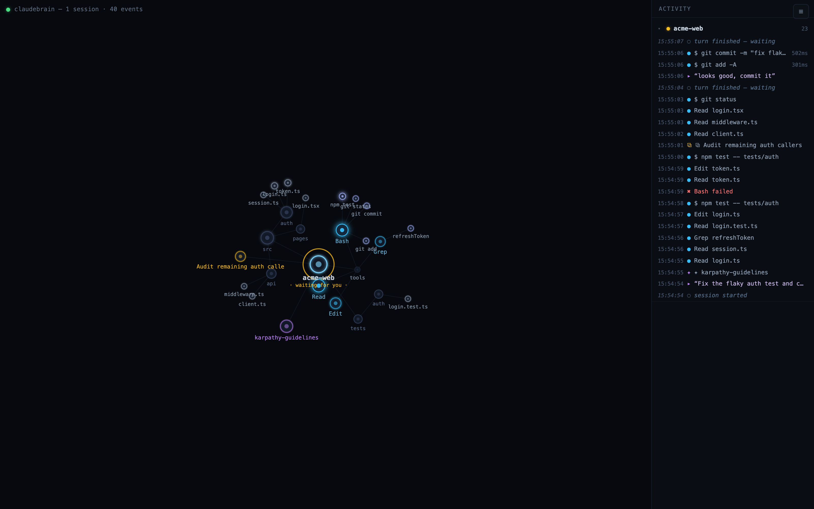
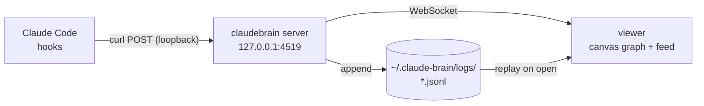

# claudebrain

**Watch Claude Code think.** claudebrain is an ambient, real-time visualizer for
[Claude Code](https://claude.com/claude-code): a dark synapse graph that lights up
as Claude works — every session, skill, tool call, file edit, background task, and
subagent, pulsing across a living map of your repos.



Keep it on a second monitor. Sessions bloom in as clusters, actions fire as bright
pulses along their paths, files Claude touches assemble into your repo's directory
tree, and a session that's waiting for your input pulses amber — the graph doubles
as a *"which session needs me?"* radar.

## Features

- **Live activity graph** — one canvas, all your concurrent Claude Code sessions.
  Nodes for skills, tools, files (grouped by directory), bash commands, background
  tasks, subagents, and messaged peer agents.
- **Action pulses** — every tool call travels its path with an inline label
  (`$ npm test`, `Edit login.ts`, `✦ /my-skill`). Failures pulse red. Prompts
  ripple out from the session node.
- **Skill tracking** — a skill lights up when invoked and stays active until the
  turn ends, with the tool calls it drives visually attached.
- **Waiting radar** — session halos encode state: green = working, amber pulse =
  waiting for you, red pulse = needs permission, dim = ended.
- **Focus mode** — pick a single session from the top-left dropdown (or view
  all). When a background session needs your permission — or finishes a work
  stretch longer than 30s — a toast appears; click it to jump there.
- **Prompt from the UI** — when focused on a session, a prompt bar at the
  bottom types your message straight into that session's tmux pane (matched by
  working directory; only panes running Claude Code, never a shell). Respond to
  a waiting session without switching to the terminal.
- **Per-session activity feed** — collapsible groups per session, newest-active on
  top; hover a row to flash its path in the graph, click to jump to the node.
- **Inspect & copy everything** — click any node for its history: full bash
  commands (copy one line or all, paste-runnable), file edits as red/green
  git-style diffs, task/agent payloads.
- **Semantic zoom** — zoomed out, directories collapse into aggregate nodes with
  activity counts; zoom in to expand. Drag nodes to rearrange; they stay pinned
  (double-click to release).
- **Live follow mode** — toggle *⦿ follow* in the feed and incoming actions
  arrive pre-expanded: full commands and colored diffs, no hovering needed.
- **Image previews** — hover a `.png`/`.jpg`/`.svg` file node for a thumbnail
  of the actual file; click it for a full-size lightbox (Esc closes).
- **Late join & persistence** — events are logged to disk; open the viewer
  mid-session and the whole graph rebuilds instantly.
- **Zero risk to your sessions** — hooks are fire-safe: if the viewer isn't
  running, the hook exits in ~30 ms and Claude Code never notices.

## Install

### Homebrew (macOS)

```sh
brew tap softorize/tap
brew install claudebrain
```

### From source

```sh
git clone https://github.com/Softorize/claudebrain.git
cd claudebrain
npm install
npm run build
npm link   # puts `claudebrain` on your PATH
```

Requires Node 20+.

## Setup

Two commands:

```sh
claudebrain install-hooks   # wires Claude Code → claudebrain
claudebrain start           # starts the server and opens the viewer
```

`install-hooks` merges eight hook entries (SessionStart, UserPromptSubmit,
PreToolUse, PostToolUse, Notification, Stop, SubagentStop, SessionEnd) into
`~/.claude/settings.json`. It **shows you the exact diff and asks before
writing** (use `--yes` to skip the prompt), preserves any hooks you already
have, and keeps a backup next to the file.

> **Note:** only Claude Code sessions started *after* the hooks are installed
> report events. No live session handy? Run `claudebrain demo` to watch a
> synthetic one.

To undo everything:

```sh
claudebrain uninstall-hooks   # removes exactly what install-hooks added
brew uninstall claudebrain    # if installed via brew
```

## Using the viewer

| Interaction | Effect |
|---|---|
| Scroll | zoom (semantic: directories collapse/expand) |
| ⌘ + move pointer up/down | zoom in/out, anchored where the gesture began |
| Drag empty space | pan |
| Double-click empty space | return to auto-fit camera |
| Drag a node | move it; it stays pinned where dropped |
| Double-click a node | unpin it back into the physics |
| Click a node | popover with its event history, per-line copy + copy-all |
| Hover a popover line | expand the full command / diff in place |
| Hover a feed row | expand it in place + flash the action's path in the graph |
| Click a feed row | jump to that node |
| Session header in feed | click to collapse/expand that session's activity |
| ⦿ follow (feed header) | live mode: new actions arrive expanded (last 12 stay open) |
| Hover an image file node | thumbnail preview of the file |
| Click the preview | full-size lightbox; Esc or click closes |
| ☆ on a popover line | pin the command to a persistent panel on the left (copy/unpin there) |
| Session dropdown (top left) | focus one session; toasts announce background sessions needing you |
| ＋ new (top left) | start a fresh Claude Code session in a new tmux window in any folder |
| ▸ out on a popover line | expand the captured tool output inline |

## How it works



- Each hook is a `curl` that POSTs the event to `127.0.0.1:4519` and reads the
  response. Today the server always answers "allow" instantly; the
  request/response shape exists so a future debug mode can pause a session at a
  skill breakpoint and steer it — without ever touching your settings again.
- **Fail-open by design**: `--connect-timeout 1` + `|| true` means a stopped
  viewer costs ~30 ms per event and can never block or fail a Claude Code
  session.
- **Loopback + token auth**: the server binds `127.0.0.1` only. A secret token
  (generated into `~/.claude-brain/token`) is required by the hook endpoint, the
  page, and the WebSocket — a random browser tab can't read your activity or
  poke the endpoint.
- **Your data stays local**: events (prompts, commands, file paths — string
  fields capped at 2000 chars) are stored as plaintext JSONL under
  `~/.claude-brain/logs/`, the same sensitivity class as the transcripts Claude
  Code already keeps in `~/.claude`. Nothing leaves your machine.

## Configuration

| Environment variable | Default | Purpose |
|---|---|---|
| `CLAUDEBRAIN_PORT` | `4519` | server port (re-run `install-hooks` after changing) |
| `CLAUDEBRAIN_HOME` | `~/.claude-brain` | token + event logs |
| `CLAUDEBRAIN_SETTINGS` | `~/.claude/settings.json` | settings file hooks are installed into |

CLI commands: `start [--no-open]`, `install-hooks [--yes]`,
`uninstall-hooks [--yes]`, `demo`, `version`, `help`.

## Troubleshooting

- **Viewer is empty** — sessions must be started *after* `install-hooks`; check
  the server is running (`curl -s http://127.0.0.1:4519/health`).
- **401 in the browser** — use the exact URL printed by `claudebrain start`
  (it carries the token).
- **Changed the port** — re-run `claudebrain install-hooks` so the hook
  commands point at the new port.
- **Remove a stale session from the graph** — sessions idle >12 h aren't
  replayed; to purge earlier, delete its file in `~/.claude-brain/logs/`.

## Development

```sh
npm install
npm run build    # tsc (server) + tsc --noEmit (web) + esbuild bundle
npm test         # node --test over the built modules
npm start
```

CI runs build + tests on Ubuntu/macOS × Node 20/22. Tagging `vX.Y.Z` builds and
tests, publishes a GitHub release with the npm tarball (prebuilt `dist/`), and
dispatches a formula update to
[Softorize/homebrew-tap](https://github.com/Softorize/homebrew-tap).

## Roadmap

- Session replay with a timeline scrubber (the JSONL logs already contain
  everything needed).
- Debug mode: pause on skill breakpoints, swap the skill about to run, inject
  context mid-session (the request/response hook protocol is already in place).
- Native menu-bar app wrapper.

## License

[MIT](LICENSE) © Softorize
